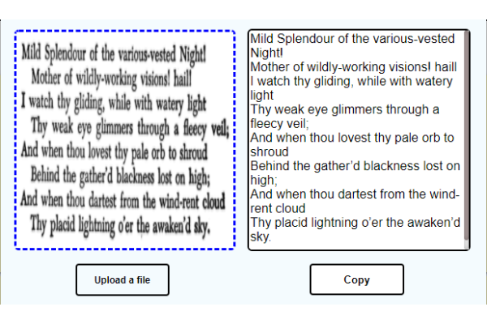

# RapidOCR
A simple chrome extension for OCR

A super simple and lightweight chrome extension for OCR making use of the popular Tesseract.js framework. 
RapidOCR functions without the need for images to be uploaded and thus works fast. It directly grabs image data
through javascript's FileReader and passes it to Tesseract.

Available for use directly from the Chrome web store: https://chrome.google.com/webstore/detail/rapidocr/djdfbiacpjncknmcadmgeedhnpikcknp?hl=en-GB&authuser=0

